# SAP FSDM GitLab CI Test Pipeline

Starter repository for a GitLab CI/CD test harness that loads configurable CSV entities into SAP S/4HANA FSDM `/FSDM/D_*` tables, validates the inserted rows through JDBC, calls SAP RFC/job endpoint APIs, and validates each downstream data-flow checkpoint.

The repository is intentionally configuration-first:

- entity/table load scope lives in `config/entities.csv`
- RFC/job sequence and parameters live in `config/jobs.csv`
- expected-output validations live in `config/validations.csv`
- SAP HANA URL, user, password, RFC URL, and tokens are supplied as masked GitLab CI/CD variables

## Target Flow

```mermaid
flowchart LR
  CSV["Input CSV files"] --> D["/FSDM/D_* load by JDBC"]
  D --> DVAL["Validate loaded D data"]
  DVAL --> ACT["RFC job: Activate"]
  ACT --> AVAL["Validate activated /FSDM/A_* data"]
  AVAL --> Z30["RFC job: Z30 RSPC chain"]
  Z30 --> Z30VAL["Validate Z30 outputs"]
  Z30VAL --> Z40["RFC job: Z40 RSPC chain"]
  Z40 --> SNAP["Balance snapshot"]
  SNAP --> GAI["GAI"]
  GAI --> NET["Netting"]
  NET --> FINAL["Final expected-data comparison"]
```



## GitLab Variables

Create these as masked/protected variables in GitLab. Do not commit real values.

| Variable | Purpose |
| --- | --- |
| `HANA_JDBC_URL` | SAP HANA JDBC URL |
| `HANA_USER` | SAP HANA technical user |
| `HANA_PASSWORD` | SAP HANA technical-user password |
| `HANA_SCHEMA` | Optional schema qualifier |
| `HANA_JDBC_DRIVER_JAR` | Runner-local path to the SAP HANA JDBC driver JAR |
| `HANA_JDBC_DRIVER_URL` | Optional internal URL used by CI to download the driver JAR |
| `RFC_HTTP_BASE_URL` | Base URL for the API wrapper that triggers SAP RFC/jobs |
| `RFC_HTTP_TOKEN` | Optional bearer token for the RFC endpoint API |
| `RUN_SAP_INTEGRATION` | Set to `true` to run the SAP integration job automatically |
| `AUDIT_TABLE` | HANA audit table for failed comparisons, default `ZCI_FSDM_FLOW_AUDIT` |

## Local Commands

The project needs Java 17 and Maven. The SAP HANA JDBC driver is only needed for real integration runs.

```bash
mvn test
mvn -DskipTests package
java -jar target/fsdm-ci-harness.jar validate-config
```

For a real run:

```bash
java -cp "target/fsdm-ci-harness.jar:/path/to/ngdbc.jar" \
  io.github.theguptasamrat.fsdmci.App run-flow \
  --entities config/entities.csv \
  --jobs config/jobs.csv \
  --validations config/validations.csv
```

## Notes

The sample `/FSDM/D_*` and `/FSDM/A_*` table names in `config/` are placeholders. Replace them with the exact generated/customer table names from the target S/4HANA FSDM system before enabling the integration job.

The repository includes a HANA DDL example for the audit table in `docs/hana-audit-table.sql`.

## Documentation

- `docs/implementation-plan.md`
- `docs/configuration.md`
- `docs/gitlab-setup.md`
- `docs/requirements-mapping.md`
